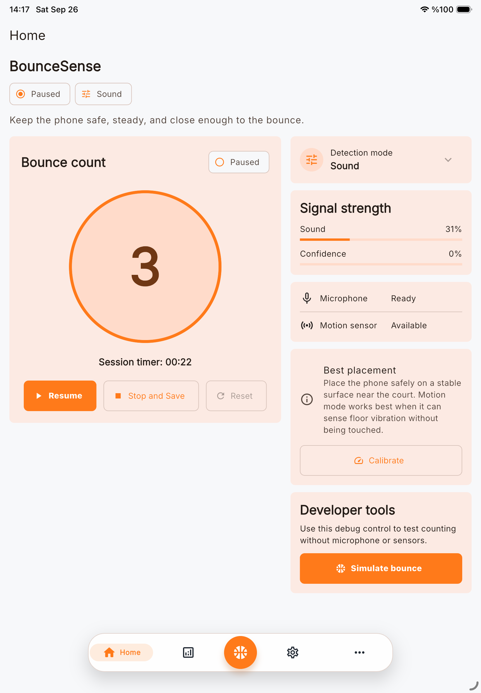
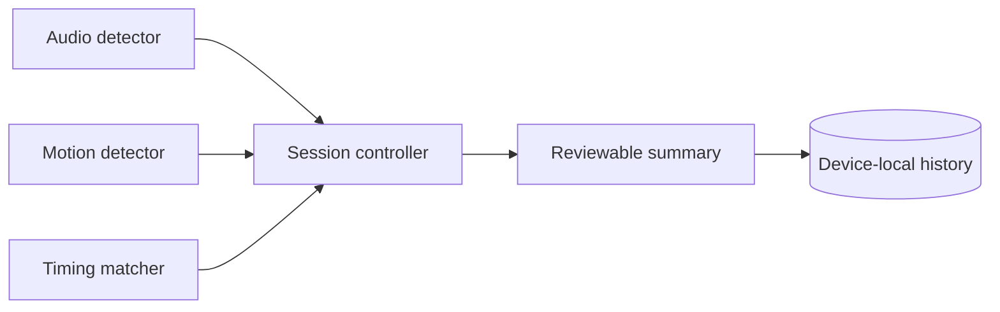
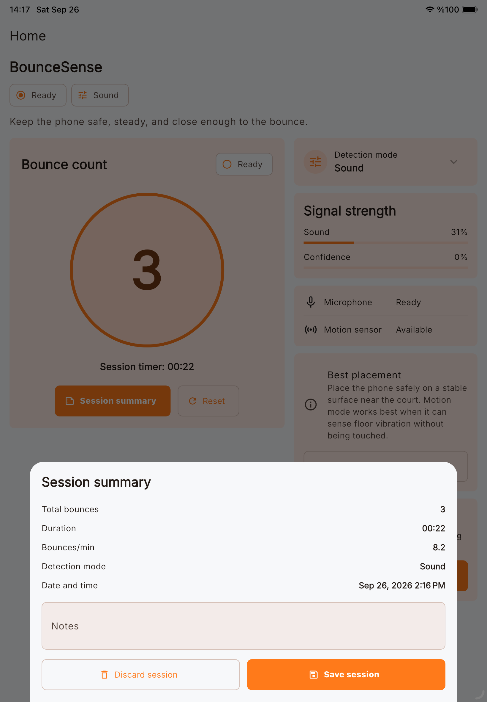
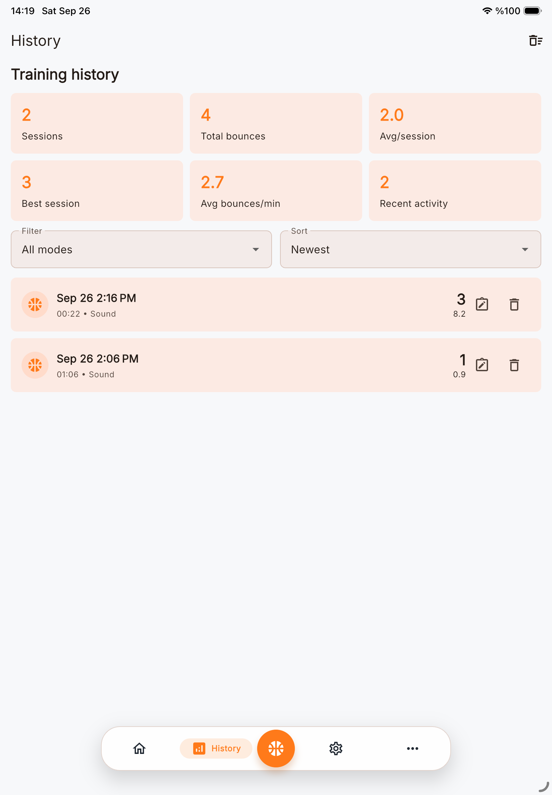
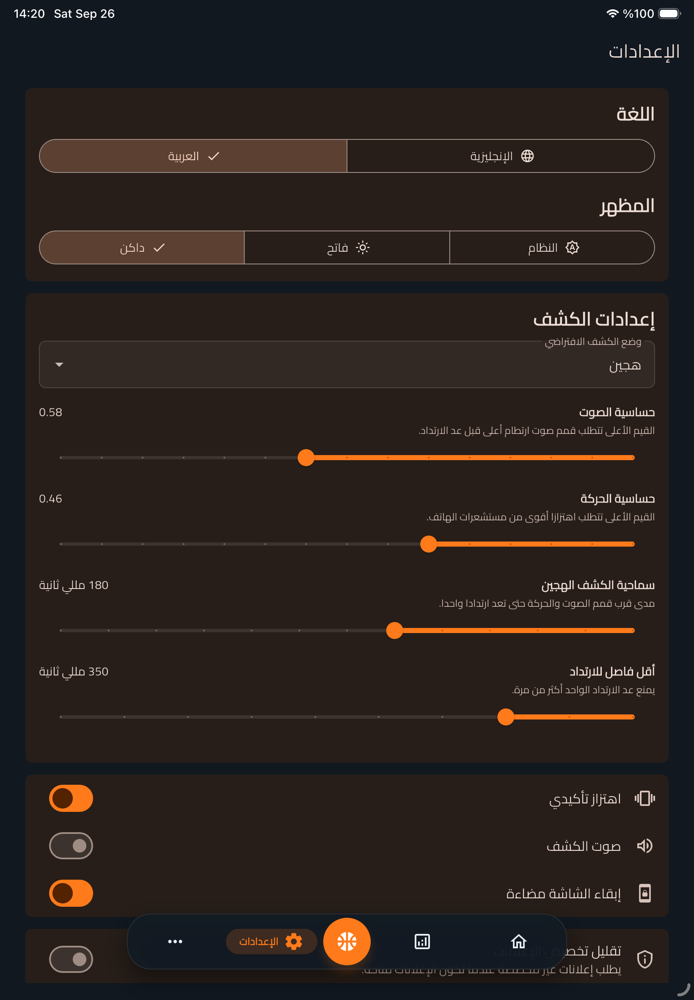

# BounceSense

A Flutter basketball practice utility joining detection modes, session controls and device-local history.

This is a documentation and visual showcase. The application source code is not included. Technical descriptions and earlier test results come from the prepared project documentation; those application tests were not repeated for this export.

**Portfolio:** [English](https://ideabat.com/portfolio/bouncesense-basketball-training-app/) · [Türkçe](https://ideabat.com/tr/portfolio/bouncesense-basketball-training-app/) · [العربية](https://ideabat.com/ar/portfolio/bouncesense-basketball-training-app/)

**Case study:** [English](https://ideabat.com/case-study/bouncesense-local-first-bounce-tracking/) · [Türkçe](https://ideabat.com/tr/case-study/bouncesense-local-first-bounce-tracking/) · [العربية](https://ideabat.com/ar/case-study/bouncesense-local-first-bounce-tracking/)

## Ragıp Mullamusa’s contribution

I developed BounceSense’s Flutter session workflow, detector services, native permission handling, local persistence, bilingual interface and PHP information website under Ideabat. The documentation attributes hands-on engineering to me, without establishing a client arrangement or a public source license.

[Android listing](https://play.google.com/store/apps/details?id=bouncesense.ideabat.com). The documented local build is not asserted to be the currently distributed version.

## At a glance

| Area | Implementation |
|---|---|
| Modes | Sound, Motion and Hybrid bounce estimation |
| State | Flutter/Dart and Provider |
| Signals | Audio recording and motion sensor services |
| Storage | JSON summaries and preferences through SharedPreferences |
| Account model | No account backend or cloud session database |
| Languages | English and Arabic in the app and website |
| Connectivity | Main interface requires internet despite device-local history |

## Give each component one responsibility

This conceptual diagram separates signal processing from session control and persistence. Detector events are inputs, while the controller owns start, pause, resume and stop. Saving is an explicit action after review. The documented native demonstration uses synthetic debug events; the displayed counts do not measure real basketball accuracy. Physical calibration remains a separate task.

BounceSense is a basketball-training utility developed by Ideabat. Its software task is more specific than displaying a live number: a user needs to choose a detection approach, control an active session and decide what to keep afterward. The implementation pairs a Flutter mobile application with a PHP public website. There is no account backend or cloud session database.

*Native iPad simulator captures with synthetic records; this is not an accuracy study.*

## Context and objectives

The implementation supports individual players and coaches tracking bounce-focused practice. The observable design objective is continuity from detection to review: count and elapsed time belong to one session, and a completed session can become a persistent local record. Adjustable modes and thresholds acknowledge that phone position, background sound, surface and sensor availability vary.

No customer interviews, commercial metrics or athlete-performance results were supplied. This case study therefore describes delivered software behavior and its verification, rather than claiming measured training improvement.

## The user workflow

Start selects the appropriate detector after any required microphone authorization. The controller coordinates preparation, countdown and listening. Pause stops capture and freezes the session; Resume rechecks permission for sound-based modes. Stop produces a summary with count, duration, rate and mode, plus optional notes. Save inserts the result into local History.

## Architecture and data boundaries

Audio and motion detector services emit structured events. The Hybrid service uses a timing matcher to associate peaks from both streams, with a configured minimum interval between counts. The session controller owns state transitions and detector lifetimes; it does not make History responsible for sensor capture.

`SessionRepository` writes JSON summaries through `StorageService` before notifying the interface. IDs make session insertion idempotent, and a failed save leaves the summary available for retry. Recovery snapshots capture unfinished session state. Settings, language and appearance use the same device-local persistence boundary.

## Permissions and integration decisions

Microphone authorization has one app-level owner. Sound and Hybrid Start use the native permission path; Motion does not request microphone access. Fresh simulator tests showed Apple's prompt for both Sound and Hybrid.

Ads, consent, reviews and microphone presentations share coordination. A Google test ad was observed, but successful live consent configuration and production delivery are not inferred from that. The website support action remains an email link; this work sent no email.

## Localization and the surrounding website

English and Arabic are implemented in the app and public site. RTL affects layout and navigation, not just translated labels. Language and dark-mode preferences persisted after restart. 

The PHP site offers product, support, privacy and terms routes with shared CSS/JavaScript and persisted theme controls.  The site includes labeled illustrative phone artwork, and its store buttons remain disabled in this checkout. Turkish is supplied for this case study, not as an additional product language.

## Delivered capability and verification

Build 4 passed 99 automated tests, clean static analysis and iOS/Android Release builds in the same-workspace audit. Native iPad simulator checks covered the microphone flow and a Sound session through saved History; browser checks opened the actual PHP pages and exercised language/theme controls.

These results establish implementation and observed behavior within those environments. Native Android capture is blocked by the available emulator; physical sensor accuracy, calibration, TestFlight and iPhone testing remain outstanding. No business-impact percentage or store-approval guarantee is claimed.

## Screen walkthrough

These real application captures come from the project’s prepared publication material. Demonstration records are synthetic; a screen illustrates the interface, not a production deployment or a permission test.

### 01 — A paused Sound session with three synthetic bounce events and a 22-second timer. Debug controls are visible.

### 02 — Session summary showing three synthetic bounces, elapsed time, Sound mode, notes and Save session.

### 03 — English training history with two synthetic sessions and locally calculated statistics.

### 04 — Arabic right-to-left settings in dark mode, including language, appearance and detection sensitivity controls.

## Evidence and availability

Implementation and historical validation descriptions above are supported by the project’s prepared documentation. The application tests were not rerun for this documentation export. The screenshots demonstrate the captured version, not current service availability, customer adoption or measured commercial outcomes.

## Ownership and technical review

This repository contains documentation and approved visual material, not an application source release. Presentation through Ideabat does not transfer a client’s ownership. For employment, collaboration or technical-review inquiries, contact Ragıp Mullamusa through Ideabat. Access to client-owned source requires prior permission from the project owner and compliance with applicable confidentiality requirements. Requests are reviewed individually; source access is not guaranteed. No software license or redistribution permission is granted by this showcase.

## Contact

Ragıp Mullamusa is the founder of [Ideabat](https://ideabat.com/). For relevant engineering, employment or collaboration inquiries, use [the contact page](https://ideabat.com/contact-us/) or [info@ideabat.com](mailto:info@ideabat.com).
